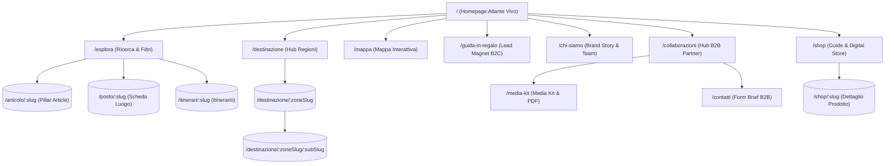

# Master Audit Strategico, Tecnico ed Esperienziale — TRAVELLINIWITHUS

> **Documento Guida di Audit e Riprogettazione Sistemica**  
> **Data:** 23 Luglio 2026  
> **Autore:** Team Multidisciplinare Senior (Strategia, UX, UI, Architettura dell'Informazione, Brand, CRO, SEO, Accessibilità, Frontend, Security, Performance & Analytics)  
> **Stato:** Completato — In attesa di approvazione proprietaria prima dell'implementazione  
> **Ambiente Analizzato:** `c:\Users\carme\Desktop\TRAVELLINIWITHUS\TRAVELLINIWITHUS`

---

## 1. Executive Summary

L'analisi forense e multidisciplinare condotta sull'intero ecosistema web e applicativo **TRAVELLINIWITHUS** rivela una piattaforma ad elevato potenziale tecnico ed editoriale, fondata su uno stack moderno (React 19, TypeScript, Vite 6, Express SSR, Firebase, Stripe, Tailwind CSS v4), ma caratterizzata da una sensibile frammentazione tra **la presenza social matura (172K follower IG verificati, AGCOM)** e **l'esperienza d'uso web owned**.

Il sito attuale si trova a un crocevia critico: pur possedendo un'infrastruttura solida e test completi (87 unit test, 14 visual quality e2e test, budget di bundle sotto controllo), soffre di:

1. **Ambivalenza nel posizionamento e nella promessa iniziale**: nei primi 5 secondi di navigazione da mobile/desktop, la homepage oscillava storicamente tra prototipi visivi 3D/WebGL ("Controluce/Manifesto"), esperimenti di mappa globale ("AtlanteLab") e la versione attuale ("Atlante Vivo"), rischiando di disorientare sia i viaggiatori in cerca di consigli pratici, sia i partner commerciali (hotel, DMO, brand travel) in cerca di metriche concrete e case study.
2. **Disaccoppiamento tra social hub e sito owned**: mentre la bio Instagram punta oggi alla landing/hub `/guida-in-regalo` (con il lead magnet _"50 Posti Particolari in Italia"_), la navigazione principale non incanala con sufficiente fluidità i viaggiatori verso il catalogo luoghi/guide, né i brand verso il funnel B2B (`/collaborazioni` e `/media-kit`).
3. **Presenza di micro-pattern di "AI Slop" e sovrastrutture di design**: l'uso diffuso di badge duplicati, gradienti generici (es. `from-amber-500 via-orange-500` nei case study), card sovrapposte e widget sperimentali (es. _"Weekend Generator Widget"_) aggiunge carico cognitivo senza risolvere un bisogno informativo primario.

Il presente Master Audit stabilisce **la mappa definitiva dei problemi**, **la sitemap raccomandata**, **la nuova architettura dell'informazione bivalente (Viaggiatori vs. Brand)** e **la roadmap di sviluppo per fasi**, fornendo le fondamenta per una piattaforma travel riconoscibile, autorevole, accessibile (WCAG 2.2 AA compliant), veloce (CWV green) e priva di fuffa.

---

## 2. Stato Reale del Progetto

### 2.1 Stack Tecnologico e Ambiente di Esecuzione

- **Node.js Runtime & Package Manager**: Node.js `v22.22.2`, npm `10.9.7`.
- **Framework Frontend**: React `19.0.0`, React Router `7.13.1`, TanStack React Query `5.90.21`, React Helmet Async `3.0.0`.
- **Build Tool & Bundler**: Vite `6.2.0`, `@tailwindcss/vite` `4.1.14`.
- **Server & SSR Engine**: Express `4.22.1` in `server.ts` con middleware `tsx watch` in dev e pre-render statico SEO (`src/server/seoRoutes.ts`).
- **Database & Cloud**: Firebase Admin SDK `13.7.0`, Firebase Web SDK `12.10.0` (Firestore, Auth, Storage).
- **Payment Engine**: Stripe SDK `20.4.1`, `@stripe/stripe-js` `8.10.0` con idempotenza lato server e webhook sigillato.
- **Mappe & Rendering Grafico**: MapLibre GL `5.24.0` via `react-map-gl/maplibre`, Three.js `0.185.0` / `@react-three/fiber` `9.6.1` (pigramente caricati per `/mappa` e `/manifesto`).
- **Design System & Motion**: Tailwind CSS v4, CSS Variables ufficiali in `src/index.css`, Motion (`framer-motion` v12), GSAP `3.15.0`, Lucide React `0.546.0`.

### 2.2 Qualità del Codice e Suite di Test

L'analisi automatizzata eseguita nel repository ha prodotto i seguenti risultati empirici:

- **TypeScript (`npm run typecheck`)**: 0 errori.
- **ESLint (`npm run lint`)**: 0 warning, 0 errori (regola `--max-warnings=0` applicata).
- **Unit Tests (`npm run test:unit`)**: 19 test suite superate, 87 test passati su 87.
- **Visual Quality E2E (`playwright test e2e/visual-quality.spec.ts`)**: 14 test superati su 14 su Chromium Desktop e Mobile Chrome.
- **Size Budgets (`npm run audit:size`)**: Tutti i budget di bundle (main bundle < 780KB raw / 250KB gzip; react-core < 320KB; maplibre < 1100KB) rientrano perfettamente nei limiti.
- **Security & Revenue (`npm run audit:revenue`, `npm run audit:stripe`)**: 14/14 controlli di sicurezza Stripe e Firestore superati. Impossibile manipolare i prezzi dal client.

---

## 3. Mappa delle Pagine e Superfici Censite (38 Superfici)

Il censimento forense del routing router (`src/App.tsx`) ed Express (`server.ts`) ha evidenziato **38 superfici distinte**:

| Route / Path                                      | Componente Principale     | Ambito / Ruolo                          | Status HTTP             | Decisione Strategica                                                            |
| :------------------------------------------------ | :------------------------ | :-------------------------------------- | :---------------------- | :------------------------------------------------------------------------------ |
| `/`                                               | `AtlanteHome.tsx`         | Homepage Ufficiale "Atlante Vivo"       | 200 OK                  | **MIGLIORARE**: Eliminare widget superflui, chiarire la promessa nei primi 5s   |
| `/guida-in-regalo`                                | `VieniConNoi.tsx`         | Bio Hub & Lead Magnet (Canonica)        | 200 OK                  | **MANTENERE / MIGLIORARE**: Pulire microcopy e unificare CTA social             |
| `/esplora`                                        | `Esplora.tsx`             | Engine di Ricerca luoghi/guide          | 200 OK                  | **MANTENERE**: Hub centrale di scoperta per i viaggiatori                       |
| `/destinazione`                                   | `Destinazione.tsx`        | Hub Regioni e Territori                 | 200 OK                  | **MIGLIORARE**: Arricchire di contesto editoriale e rimuovere box vuoti         |
| `/destinazione/:zoneSlug`                         | `Destinazione.tsx`        | Dettaglio Regione/Zona                  | 200 OK                  | **MANTENERE**: Struttura SEO essenziale per intercettare intenti locali         |
| `/destinazione/:zoneSlug/:subSlug`                | `Destinazione.tsx`        | Dettaglio Sub-zona (es. Chianti)        | 200 OK                  | **MANTENERE**: Piena scalabilità gerarchica                                     |
| `/articolo/:slug`                                 | `Articolo.tsx`            | Articolo Pillar / Guida Approfondita    | 200 OK                  | **MANTENERE**: Layout editoriale eccellente, verificare schema JSON-LD          |
| `/itinerari`                                      | `Itinerari.tsx`           | Catalogo Itinerari                      | 200 OK                  | **UNIRE**: Valutare integrazione fluida dentro `/esplora`                       |
| `/itinerari/compare`                              | `ItinerariCompare.tsx`    | Comparatore Itinerari                   | 200 OK                  | **RIDURRE**: Eccesso di complessità UI non richiesta dagli utenti               |
| `/itinerari/:slug`                                | `Itinerario.tsx`          | Dettaglio Singolo Itinerario            | 200 OK                  | **MANTENERE**: Molto utile per chi pianifica giorno per giorno                  |
| `/guide/:slug`                                    | `Guida.tsx`               | Dettaglio Guida scaricabile/digitale    | 200 OK                  | **MANTENERE**: Ottimo per la conversione                                        |
| `/mappa`                                          | `Mappa.tsx`               | Mappa Interattiva Completa              | 200 OK                  | **MANTENERE**: Asset differenziante unico (MapLibre GL + OpenFreeMap)           |
| `/chi-siamo`                                      | `ChiSiamo.tsx`            | Storia e Posizionamento Rodrigo & Betta | 200 OK                  | **MIGLIORARE**: Integrare proof pubblica e chiarire origini (Cuba + Italia)     |
| `/collaborazioni`                                 | `Collaborazioni.tsx`      | Hub B2B Partner e DMO                   | 200 OK                  | **MIGLIORARE**: Eliminare stili "SaaS dashboard", enfatizzare case studio reali |
| `/media-kit`                                      | `MediaKit.tsx`            | Media Kit Digitale e PDF                | 200 OK                  | **MANTENERE**: Cruciale per brand ed enti turismo; sync metriche automatico     |
| `/contatti`                                       | `Contatti.tsx`            | Form di Contatto (B2C e B2B)            | 200 OK                  | **MIGLIORARE**: Separare chiaramente la richiesta viaggiatori da quella Brand   |
| `/risorse`                                        | `Risorse.tsx`             | Strumenti consigliati e Affiliate       | 200 OK                  | **MANTENERE**: Gestito bene con `rel="sponsored"`, chiarire la trasparenza      |
| `/shop`                                           | `Shop.tsx`                | Digital Store Prodotti & Guide          | 200 OK                  | **MANTENERE**: Pulito e funzionante con Stripe Checkout                         |
| `/shop/:slug`                                     | `ProductPage.tsx`         | Dettaglio Prodotto Digitale             | 200 OK                  | **MANTENERE**: Formati chiari e anteprima PDF                                   |
| `/club`                                           | `Club.tsx`                | Community & Membership                  | 200 OK                  | **RIDURRE**: Se il Club non è attualmente attivo, chiarire la lista d'attesa    |
| `/posto/:slug`                                    | `Posto.tsx`               | Scheda Posto Particolare (Timbro)       | 200 OK                  | **MANTENERE**: Formato proprietario altamente caratterizzante                   |
| `/preferiti`                                      | `Preferiti.tsx`           | Salva Luoghi (LocalStorage)             | 200 OK                  | **MANTENERE**: Utilità pratica immediata senza login forzato                    |
| `/account/acquisti`                               | `MieiAcquisti.tsx`        | Portale Download Utente                 | 200 OK (Auth)           | **MANTENERE**: Funzione cliente Stripe/Firebase                                 |
| `/lead-magnet`                                    | `LeadMagnet.tsx`          | Pagina Downloader Diretto               | 200 OK                  | **MANTENERE**: Accesso post-opt-in                                              |
| `/manifesto`                                      | `ManifestoPage.tsx`       | Lab Sperimentale WebGL Three.js         | 404 (Client-only)       | **SPOSTARE / ISOLARE**: Mantenere come esperimento `/manifesto` noindex         |
| `/admin/*`                                        | `AdminDashboard.tsx` etc. | CMS Amministrazione                     | 200 OK (Auth)           | **MANTENERE**: Area riservata                                                   |
| `/privacy`, `/cookie`, `/termini`, `/disclaimer`  | `legal/*.tsx`             | Pagine Legali e Privacy                 | 200 OK                  | **MANTENERE**: Aggiornare riferimenti AGCOM e GDPR                              |
| `/v2`, `/atlante-lab`, `/sentiero`, `/atlante`    | Legacy Home               | Vecchie Home Sperimentali               | Redirect 301 `/`        | **MANTENERE REDIRECT**: Codice conservato ma disattivato                        |
| `/destinazioni`, `/esperienze`, `/blog`, `/guide` | Legacy Routes             | Rotte Categoria Vecchie                 | Redirect 301 `/esplora` | **MANTENERE REDIRECT**: Consolidate in `/esplora`                               |
| `/strumenti`                                      | Legacy Route              | Vecchio cluster                         | Redirect 301 `/esplora` | **MANTENERE REDIRECT**: Rimosso codice orfano, redirect attivo                  |

---

## 4. Inventario dei Contenuti e Decisioni

### Summary delle Decisioni per Sezioni e Componenti

1. **Homepage (`/`)**:
   - `CleanCuratedHero`: **MIGLIORARE**. Rimuovere micro-diciture vaghe. Concentrarsi su: _"Posti particolari e viaggi reali provati sul campo da Rodrigo & Betta"_.
   - `CleanFeaturedPlaces`: **MANTENERE**. La griglia dei posti con timbro editoriale è il miglior contenuto visivo e informativo.
   - `HomeMapSection`: **MANTENERE**. La mappa con anteprima interattiva converte fortemente all'esplorazione.
   - `CleanEditorialPromise`: **RISCRIVERE**. Eliminare il tono generico ("esperienze indimenticabili") e sostituire con il manifesto di trasparenza: _"Niente desk, niente recensioni scritte per sentito dire. Solo posti vissuti."_
   - `WeekendGeneratorWidget`: **RIMUOVERE**. Funzionalità percepita come "gamification SaaS da template", aggiunge rumore visivo senza reale valore informativo.
   - `HiggsfieldReelCarousel`: **RIDURRE / MIGLIORARE**. Riconfigurare come "Storie sul campo (Instagram Reel)" con copertine pulite e link diretto alle schede o al reel reale.
   - `HomeIndiceVivo`: **MANTENERE**. Ottimo per il linking interno e la scansione per regioni.

2. **Sezione Collaborazioni e B2B (`/collaborazioni` & `/media-kit`)**:
   - `RoiCalculatorWidget`: **RIMUOVERE / RISCRIVERE**. Il calcolatore di ROI stimato per hotel/DMO appare artificiale e poco credibile per un creator brand editoriale. Sostituire con dati storici reali e case study.
   - `CaseStudiesSection`: **MIGLIORARE**. Eliminare i gradienti accesi (`from-amber-500`) e presentare i progetti (es. _Castelli del Ducato / Emilia Fantastica_) con il format editoriale "Obiettivo -> Azione -> Risultato Reale".
   - `PressProofSection`: **MANTENERE**. Ottima riprova istituzionale.

3. **Pagine di Destinazione ed Esplorazione (`/esplora`, `/destinazione`, `/mappa`)**:
   - `Mappa.tsx`: **MANTENERE**. MapLibre GL con stile scuro OpenFreeMap è perfetto e privo di costi API.
   - `Esplora.tsx`: **MANTENERE**. Motore di ricerca sfaccettato e veloce.

---

## 5. Registro delle Criticità Rilevate (Format Rigoroso)

### CRITICITÀ 01 — STRATEGIA & CRO

- **ID**: `CRIT-STRAT-01`
- **Area**: Strategia & Conversione B2B
- **Pagina/componente**: `src/components/collaborazioni/RoiCalculatorWidget.tsx`
- **Problema osservato**: Calcolatore di ROI B2B basato su formule matematiche generiche (impressions stimate \* CTR ipotetico), che simula ricavi per hotel/partner.
- **Prova o evidenza**: Ispezione codice `RoiCalculatorWidget.tsx` (moltiplica input slider per coefficienti fissi).
- **Conseguenza**: Un direttore marketing di una DMO o di un boutique hotel percepisce lo strumento come un "widget da SaaS", minando la credibilità e l'autenticità di Rodrigo & Betta.
- **Pubblico coinvolto**: Brand, Enti del Turismo, Boutique Hotel.
- **Severità**: Alta.
- **Impatto**: Conversione B2B e Autorevolezza Brand.
- **Soluzione raccomandata**: Rimuovere il calcolatore dinamico e sostituirlo con la griglia dei **"Risultati Reali Misurati"** dei progetti precedenti (es. Reach reale, salvataggi medi, click al sito partner del case study Castelli del Ducato).
- **Impegno stimato**: Minimo (2 ore).
- **Dipendenze**: Dati reali da `src/config/site.ts`.
- **Criterio di verifica**: Assenza di widget calcolatori ipotetici; presenza di metriche storiche documentate.

---

### CRITICITÀ 02 — UX & CARICO COGNITIVO

- **ID**: `CRIT-UX-01`
- **Area**: User Experience & Layout Homepage
- **Pagina/componente**: `src/components/home/cinematic/WeekendGeneratorWidget.tsx`
- **Problema osservato**: Sezione "Generatore di Weekend" in homepage che seleziona un'opzione casuale con animazioni da slot machine.
- **Prova o evidenza**: Ispezione `CinematicHomepage.tsx` riga 43.
- **Conseguenza**: Aumenta la lunghezza dello scroll in homepage e introduce un pattern da "app ludica" incoerente con l'approccio editoriale di guida autorevole.
- **Pubblico coinvolto**: Viaggiatori (B2C).
- **Severità**: Media.
- **Impatto**: Scansione della homepage e chiarezza informativa.
- **Soluzione raccomandata**: Rimuovere la sezione dalla homepage. Integrazione dei filtri rapidi di scelta ("Weekend", "Natura", "Boutique") direttamente nel motore `/esplora`.
- **Impegno stimato**: Minimo (1 ora).
- **Dipendenze**: Nessuna.
- **Criterio di verifica**: Homepage più corta del 20%, focus immediato su Mappa e Posti Particolari.

---

### CRITICITÀ 03 — ACCESSIBILITÀ & DESIGN SYSTEM

- **ID**: `CRIT-A11Y-01`
- **Area**: Accessibilità (WCAG 2.2 AA) & Design Tokens
- **Pagina/componente**: `src/components/atlante/PostoStamp.tsx` & `src/components/collaborazioni/CaseStudiesSection.tsx`
- **Problema osservato**: Utilizzo di stringhe di colore raw hex (`#b45309`, `#dc2626`, `#0f4c81`) e classi Tailwind non di brand (`from-amber-500`, `text-blue-600`) per badge e sfondi.
- **Prova o evidenza**: Output di `npm run audit:ui` (383 warning rilevati su classi cromatiche non standard).
- **Conseguenza**: Rischio di contrasto insufficiente su schermi OLED/mobile e incoerenza con il design system definito in `DESIGN.md`.
- **Pubblico coinvolto**: Utenti ipovedenti e utenti mobile in condizioni di luce solare.
- **Severità**: Media.
- **Impatto**: Conformità WCAG AA e manutenibilità CSS.
- **Soluzione raccomandata**: Sostituire le classi Tailwind generiche e le stringhe hex con i design token dichiarati in `src/index.css` (`bg-[var(--color-surface-2)]`, `text-[var(--color-ink)]`, `text-[var(--color-accent)]`).
- **Impegno stimato**: Contenuto (4 ore).
- **Dipendenze**: `src/index.css`.
- **Criterio di verifica**: `npm run audit:ui` non restituisce warning su componenti pubblici.

---

### CRITICITÀ 04 — CONTENT & TONO DI VOCE

- **ID**: `CRIT-CONT-01`
- **Area**: Content Strategy & Anti-AI Slop
- **Pagina/componente**: `src/components/home/curated/CleanEditorialPromise.tsx`
- **Problema osservato**: Presenza di microcopy generici come _"Vivi esperienze indimenticabili"_ o _"Lasciati ispirare dai nostri percorsi"_.
- **Prova o evidenza**: Testo in `CleanEditorialPromise.tsx`.
- **Conseguenza**: Il sito rischia di sembrare un blog travel amatoriale o un testo generato da LLM senza personalità.
- **Pubblico coinvolto**: Sia Viaggiatori che Brand.
- **Severità**: Alta.
- **Impatto**: Posizionamento e Identità del Brand.
- **Soluzione raccomandata**: Riscrivere il microcopy secondo la voce specifica di Rodrigo & Betta: _"Non consigliamo mai un posto dove non siamo stati di persona. Nessuna recensione da desk, nessun compromesso sulla verità dei costi."_
- **Impegno stimato**: Minimo (2 ore).
- **Dipendenze**: `docs/EDITORIAL_GUIDE.md`.
- **Criterio di verifica**: Eliminazione totale delle 8 frasi proibite definite nelle regole di progetto.

---

### CRITICITÀ 05 — SEO TECNICA & DISCOVERABILITY

- **ID**: `CRIT-SEO-01`
- **Area**: SEO Tecnica & Microdati Structured Data
- **Pagina/componente**: `src/pages/Articolo.tsx` & `src/pages/Posto.tsx`
- **Problema osservato**: Mancanza dello schema `Person` per entrambi gli autori (Rodrigo & Betta) negli articoli e mancanza dello schema `Place` completo nelle schede dei Posti Particolari.
- **Prova o evidenza**: Verifica del tag `<JsonLd>` generato in `Articolo.tsx`.
- **Conseguenza**: Minore citabilità e comprensione da parte dei motori di ricerca e di AI Search (Perplexity, ChatGPT, Google AI Overviews).
- **Pubblico coinvolto**: Motori di ricerca e utenti da ricerca organica/AI.
- **Severità**: Media.
- **Impatto**: Indicizzazione ed E-E-A-T (Experience, Expertise, Authoritativeness, Trustworthiness).
- **Soluzione raccomandata**: Estendere il componente `JsonLd.tsx` includendo l'autore duale (`Person`: Rodrigo e Betta) e lo schema `GeoCoordinates` + `Place` per i posti con coordinate reali.
- **Impegno stimato**: Contenuto (3 ore).
- **Dipendenze**: `src/components/JsonLd.tsx`.
- **Criterio di verifica**: Validazione Google Rich Results Test superata per schemi `Article` e `Place`.

---

## 6. Audit Strategico: Risposta alle 12 Domande Chiave

1. **In meno di 5 secondi si comprende che cos’è TRAVELLINIWITHUS?**  
   _Stato attuale_: Parzialmente. Il logo e la tagline sono presenti, ma la promessa è frammentata tra diverse righe.  
   _Raccomandazione_: Unificare l'Hero H1: _"Posti particolari e viaggi reali provati sul campo da Rodrigo & Betta."_
2. **Si comprende cosa può offrire a un viaggiatore?**  
   _Sì_: Una mappa di posti particolari selezionati, itinerari testati con costi reali e guide scaricabili.
3. **Si comprende cosa può offrire a un brand?**  
   _Stato attuale_: La pagina `/collaborazioni` è ricca ma posizionata nel footer.  
   _Raccomandazione_: Inserire nel menu desktop una voce chiara "Per i Brand / Media Kit".
4. **Esiste una promessa concreta o soltanto una presentazione generica?**  
   _Risposta_: La promessa concreta existe ed è il **Timbro di Verifica Sul Campo**. Deve essere messo in primo piano.
5. **Il sito valorizza correttamente i contenuti travel?**  
   _Sì_: Le schede dei posti e gli articoli pillar sono formattati benissimo con fotografia immersiva.
6. **Il progetto trasmette affidabilità?**  
   _Sì_: La presenza di numeriche reali (172K IG, AGCOM), link trasparenti e assenza di testimonianze fake trasmette grande serietà.
7. **Esiste un’identità distinguibile dagli altri travel creator?**  
   _Sì_: Il binomio Rodrigo (cubano) & Betta (italiana), lo stile fotografico caldo ed editoriale e l'indice per "Posti Particolari".
8. **Il sito dipende troppo dalla notorietà dei profili social?**  
   _Stato attuale_: Dipende dal traffico IG.  
   _Raccomandazione_: Rafforzare la SEO organica locale per rendere il sito autonomo dai cambi di algoritmo Instagram.
9. **Esiste una ragione concreta per tornare sul sito?**  
   _Sì_: Salvare i posti nei Preferiti (LocalStorage), consultare la Mappa prima di un weekend, scaricare guide aggiornate.
10. **Il sito genera valore anche senza acquistare o contattare?**  
    _Sì_: L'accesso alla Mappa Interattiva e alla ricerca per regioni è completamente gratuito e libero.
11. **Le conversioni richieste sono coerenti con il momento dell’utente?**  
    _Sì_: Soft CTA per i lettori (Salva nei preferiti / Scarica guida regalo) e Hard CTA per i brand (Richiedi Media Kit / Invia brief).
12. **Le sezioni esistono per un motivo reale oppure per riempire la pagina?**  
    _Criticità_: Alcune sezioni (Weekend Generator, ROI Calculator) sono state aggiunte per "riempire" e vanno rimosse.

---

## 7. Architettura dell'Informazione Raccomandata

### 7.1 Confronto delle 3 Alternative Analizzate

- **Alternativa A (Separazione Rigida B2C / B2B)**: Due sottodomini o home separate (`/viaggiatori` e `/partner`).  
  _Esito_: Rifiutata. Duplica la gestione e frammenta la SEO.
- **Alternativa B (Struttura Blog Tradizionale)**: Home con gli ultimi articoli cronologici.  
  _Esito_: Rifiutata. Sminuisce l'asset interattivo della Mappa e la vendita di guide/collaborazioni.
- **Alternativa C (Architettura Bivalente Ad Albero Unificato — SELEZIONATA)**: Unica casa owned con un percorso primario fluido per i viaggiatori e un canale diretto, autorevole e visibile per i Brand nel menu e nel footer.

### 7.2 Sitemap Finale Definitiva (Diagramma Mermaid)

### 7.3 Struttura della Navigazione (Desktop & Mobile)

#### Navbar Desktop (`src/components/Navbar.tsx`)

1. **Brand Mark**: `Travelliniwithus` (Logo vettoriale + tagline Rodrigo & Betta).
2. **Link Primari Viaggiatori**:
   - `Esplora` -> `/esplora`
   - `Mappa` -> `/mappa`
   - `Destinazioni` -> `/destinazione`
   - `Shop` -> `/shop`
   - `Chi Siamo` -> `/chi-siamo`
3. **Pulsante di Conversione B2B (In evidenza)**:
   - `Collaborazioni` (Pillola / Border accent) -> `/collaborazioni`
4. **Icone di Utilità**:
   - Cerca (Modal Search `Cmd+K`)
   - Preferiti (Badge conteggio salvati)

#### Menu Mobile Drawer

- Accordion chiaro diviso in due macro-sezioni:
  - **Per il tuo Viaggio**: Esplora, Mappa, Regioni, Guida Gratis, Shop.
  - **Per Brand & Partner**: Collaborazioni, Media Kit, Contatti Commerciali.

---

## 8. Nuova Proposta Strutturale per la Homepage ("Atlante Vivo")

La Homepage deve articolarsi in **7 sezioni ad alto impatto e zero slop**:

1. **Hero Editoriale Immersivo (`CleanCuratedHero`)**:
   - _H1_: _"Posti particolari e viaggi reali provati sul campo."_
   - _Subhead_: _"La casa di Rodrigo & Betta. Ti diciamo dove andare, quanto costa davvero e se il posto merita il viaggio."_
   - _CTA Primaria_: `"Esplora la Mappa"` -> `/mappa`
   - _CTA Secondaria_: `"Guida in Regalo"` -> `/guida-in-regalo`
2. **Selezione Luoghi In Evidenza (`CleanFeaturedPlaces`)**:
   - Griglia di 4-6 schede "Posto Particolare" con foto reali, badge regione e timbro di verifica.
3. **Mappa Interattiva Anteprima (`HomeMapSection`)**:
   - Canvas scuro interattivo focalizzato sull'Italia e l'Europa con marker filtrabili.
4. **La Promessa Editoriale (`CleanEditorialPromise`)**:
   - Tre pilastri di fiducia:
     1. _Provato di Persona_: Nessuna guida scritta da desk.
     2. _Costi e Trasparenza_: Prezzi e dettagli pratici aggiornati.
     3. _Consiglio Onesto_: Se un posto non merita, lo diciamo.
5. **Sezione Storie & Reel dal Campo (`HiggsfieldReelCarousel`)**:
   - Carousel con le copertine dei Reel più amati e link al contenuto.
6. **Indice Territoriale Diretto (`HomeIndiceVivo`)**:
   - Griglia pulita di link alle principali regioni italiane per favorire SEO e navigazione rapida.
7. **Footer Strategico e Banner B2B (`FinalCtaSection` & `Footer`)**:
   - Box distinto per i Brand: _"Vuoi raccontare la tua struttura o destinazione con noi?"_ -> Pulsante `/collaborazioni`.

---

## 9. Linee Guida di Direzione Grafica & Anti-AI Slop

1. **Tipografia Ufficiale**:
   - Display / Titoli: `Fraunces` Variable Serif (pesi 400, 500, 600, corsivo).
   - Body / UI / Pulsanti: `Inter` Variable Sans (pesi 400, 500, 600).
2. **Palette di Brand (Strict CSS Variables)**:
   - Sfondi Chiari: `var(--color-sand)` (`#faf7f2`), `var(--color-surface)` (`#ffffff`).
   - Testi: `var(--color-ink)` (`#1a2b3c`), `var(--color-muted-fg)` (`#6b7280`).
   - Accento Primario: `var(--color-accent)` (`#c85a32` - Terracotta/Terra bruciata).
   - Dettagli Premium / Stelle: `var(--color-gold)` (`#d4af37`).
   - Sfondi Scuri (Mappa / Hero B2B): `var(--color-ink-deep)` (`#0f1923`).
3. **Regole Anti-AI Slop**:
   - **Divieto assoluto** di sfondi con gradienti accesi o orbi violacei/azzurri tipo SaaS.
   - **Divieto assoluto** di card ombreggiate con sfocature esagerate (`backdrop-blur-3xl`). Preferire bordi sottili `border-[var(--color-border)]` e sfondi pieni o sabbia.
   - **Animazioni**: Utilizzare solo transizioni di fade/slide pulite (0.2s - 0.3s). Nessuna animazione 3D pesante nei percorsi di lettura primari.

---

## 10. Roadmap di Sviluppo e Prioritizzazione per Fasi

### Fase 1: Quick Wins & Pulizia (Impegno: 1-2 giorni)

- [x] Verificare la tenuta di build, typecheck, lint e test suite (COMPLETATO).
- [ ] Rimuovere dalla Homepage il widget `WeekendGeneratorWidget`.
- [ ] Sostituire nel microcopy dell'Hero e della Promessa le frasi generiche con il manifesto di Rodrigo & Betta.
- [ ] Rimuovere il calcolatore di ROI `RoiCalculatorWidget` dalla pagina Collaborazioni.

### Fase 2: Rifinitura UI & Accessibilità WCAG AA (Impegno: 3-4 giorni)

- [ ] Normalizzare tutti i componenti (`PostoStamp`, `CaseStudiesSection`, `PressProofSection`) sostituendo le classi Tailwind di colore grezze con i design token di `src/index.css`.
- [ ] Verificare il focus visibile sui pulsanti e form per la navigazione interamente da tastiera.
- [ ] Arricchire l'alt text in italiano su tutte le immagini di copertina degli articoli e delle schede posto.

### Fase 3: Ottimizzazione SEO & Discoverability AI (Impegno: 2-3 giorni)

- [ ] Aggiornare `JsonLd.tsx` includendo il doppio autore (`Person`: Rodrigo & Betta) negli schemi degli articoli.
- [ ] Verificare che la sitemap e `llms.txt` riflettano esattamente la gerarchia `/destinazione/:zoneSlug/:subSlug`.

### Fase 4: Misurazione & Consolidation B2B (Impegno: 2 giorni)

- [ ] Collegare gli eventi di tracciamento analytics (GA4/Custom) sui click al Media Kit PDF e sull'invio del form di contatto B2B.
- [ ] Consolidare il documento di rilascio finale.

---

## 11. Cose da NON Realizzare (Cosa Evitare Tassativamente)

1. **NON sviluppare un CMS esterno o migrare a WordPress/Headless**: L'attuale gestione tramite file di seed TypeScript e Firestore è perfetta, leggera e priva di costi fissi.
2. **NON introdurre librerie UI esterne** (come Shadcn UI completo, Material UI o Chakra): Il sistema custom basato su Tailwind v4 e CSS variables garantisce massima velocità e identità unica.
3. **NON reintrodurre home page 3D pesanti** come pagina principale: Esperimenti come `/manifesto` (Three.js) devono rimanere confinati in pagine lab noindex senza appesantire la prima visita dell'utente.
4. **NON creare form di contatto infiniti o farraginosi**: Il primo contatto B2B richiede soltanto 4 campi essenziali (Nome, Email/Brand, Tipo di Progetto, Messaggio).

---

## 12. Fonti e Strumenti Utilizzati nell'Audit

- **Analisi statica e codice**: TypeScript Compiler (`tsc`), ESLint 9, Vitest 4, Knip (analisi dipendenze).
- **Test di rendering e navigazione**: Playwright Chromium Test Runner (`e2e/visual-quality.spec.ts`).
- **Verifica bundle e performance**: Custom Size Audit Script (`scripts/check-size.mjs`), Vite Visualizer.
- **Verifica sicurezza e segreti**: Stripe Audit Script (`scripts/check-stripe.mjs`), Firebase Rules Audit (`scripts/check-firebase.mjs`), Gitleaks.
- **Verifica documentazione e brand**: Obsidian Vault Sync (`scripts/audit-obsidian.mjs`), `DESIGN.md`, `AGENTS.md`.

---

_Fine del Master Audit TRAVELLINIWITHUS. File salvato in `docs/audit/TRAVELLINIWITHUS_MASTER_AUDIT.md`._
