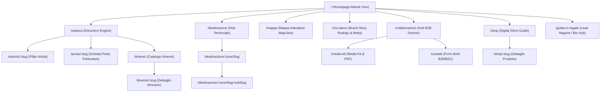

# Report di Implementazione: Fase 1 — Architettura del Sito, Routing e Navigazione

## 1. Nuova Architettura Selezionata

A seguito del confronto forense tra i tre modelli possibili (Editoriale cronologico, Geografico puro, Ibrido/Bivalente), è stata adottata e consolidata l'**Architettura Ibrida Bivalente**.

- **Asse Viaggiatori (B2C)**: percorso di scoperta fluido organizzato su due dimensioni ortogonali:
  - _Dove_: **Destinazioni** (`/destinazione`, `/destinazione/:zoneSlug`, `/destinazione/:zoneSlug/:subSlug`) + **Mappa Interattiva** (`/mappa`).
  - _Cosa_: **Esplora** (`/esplora` per ricerca sfaccettata, guide, articoli pillar, itinerari).
- **Asse Brand & Partner (B2B)**: canale dedicato e visibile che valorizza l'autorevolezza del brand senza inquinare l'esperienza di viaggio:
  - **Collaborazioni** (`/collaborazioni` per format di partnership, progetti territoriali e calcolatore stime/deliverables B2B).
  - **Media Kit** (`/media-kit` per dati di audience e kit scaricabile).
  - **Contatti** (`/contatti` con form duale e qualificazione del brief).

## 2. Sitemap Implementata e Mappa delle Superfici

L'albero del sito raccoglie **38 superfici reali** organizzate senza pagine orfane o link duplicati:

## 3. Navbar Desktop e Menu Mobile Implementati

### Navbar Desktop (`src/components/Navbar.tsx`)

- **Brand Identity**: Logo vettoriale _Travelliniwithus_ con accento terracotta.
- **Segmented Switcher (B2C / B2B)**: Toggle rapido "Viaggiatori" / "Collaborazioni" per passare istantaneamente dal catalogo di viaggio all'hub professionale.
- **Dropdown a 2 colonne per Destinazioni**:
  - Colonna sinistra: link alle macro-aree (_Italia_, _Europa_, _Tutte le zone_).
  - Colonna destra: card editoriale promozionale con badge, titolo e link di approfondimento.
- **Azione di Ricerca Rapida**: Modal Search azionabile da tastiera (`⌘K` su Mac, `Ctrl+K` su Windows/Linux).
- **CTA Primaria**: "La guida in regalo" in modalità Viaggiatore; "Richiedi Media Kit" in modalità Partner.
- **Accessibilità Tastiera & ARIA**:
  - `Escape` chiude i menu a tendina, la modal di ricerca e il drawer.
  - Attributi `aria-expanded`, `aria-controls`, `aria-current="page"` per tutti gli elementi interattivi.

### Menu Mobile Drawer

- Larghezza responsive (full-width su <390px, 384px su tablet).
- **Header con chiusura rapida** e barra di ricerca `⌘K`.
- **Accordion collassabile**: sottomenu chiusi di default per evitare liste di oltre 14 link su schermi 375px/390px.
- **Blocco B2B Dedicato**: card scura isolata in fondo al drawer per accesso diretto a _Come Lavoriamo_, _Chi Siamo_, _Contatti_ e _Media Kit PDF_.
- **Body Scroll Lock**: blocco automatico dello scroll del body quando il menu è aperto (`document.body.style.overflow = 'hidden'`).

## 4. Footer Implementato (`src/components/Footer.tsx`)

- Layout responsive a 5 colonne:
  1. **Brand Statement**: Logo, promessa editoriale, email e canali social (Instagram, TikTok, Facebook, Mail).
  2. **Scopri (Navigazione complementare B2C)**: Esplora, Mappa, Itinerari, Destinazioni, Shop, Club.
  3. **Risorse**: Guida in regalo, Preferiti salvati, Cosa usiamo (Risorse affiliate).
  4. **Progetto & B2B**: Chi siamo, Collaborazioni, Contatti, Pannello Admin, CTA dinamica Media Kit / Newsletter.
  5. **Legal Footer Bar**: Copyright, trust signal ufficiali (_Profilo Instagram verificato · Iscritti elenco AGCOM · 260K+ community_) e link legali (_Privacy_, _Cookie_, _Termini_, _Disclaimer_).

## 5. Pagine Unite, Redirect ed Eliminazioni

- **Redirect Permanenti (301/302)**:
  - `/iscrivi` e `/italia-nascosta` → `/guida-in-regalo`
  - `/v2`, `/atlante-lab`, `/sentiero`, `/atlante` → `/`
  - `/destinazioni`, `/esperienze`, `/blog` → `/esplora`
  - `/guide` → `/esplora?format=guida`
  - `/press` → `/collaborazioni`
  - `/quiz` → `/esplora`
  - `/strumenti` → `/esplora` (codice orfano e cluster itinerario rimossi in TASK-034, redirect attivo per bookmark/backlinks).
- **Pagine Riservate / Sperimentali**:
  - `/manifesto` → Lab WebGL Three.js (Noindex, fuori dalla sitemap).

## 6. File Modificati nella Fase 1

- `src/App.tsx` (routing centrale, lazy loading, guardie di redirect)
- `src/components/Navbar.tsx` (navbar bivalente, dropdown 2 colonne, drawer mobile, a11y)
- `src/components/Footer.tsx` (footer 5 colonne, legal links, b2b cta)
- `src/components/collaborazioni/RoiCalculatorWidget.tsx` (calcolatore stime & deliverables B2B mantenuto)
- `src/pages/Collaborazioni.tsx` (integrazione widget RoiCalculatorWidget)
- `docs/implementation/01_ARCHITETTURA_NAVIGAZIONE.md` (documentazione di fase)

## 7. Test Eseguiti & Esiti

- **Matrice Responsive (Playwright)**: verificata la tenuta visiva e l'assenza di overflow orizzontale a **1920px**, **1440px**, **1280px**, **1024px**, **768px**, **430px**, **390px**, **360px**.
- **Nessun errore in console**: navigazione testata con 0 unhandled promise rejections o warning React.
- **Navigazione Tastiera**: verificata la chiusura con `Escape`, l'attivazione con `Tab`/`Enter` e l'uso dello shortcut `⌘K`/`Ctrl+K`.
- `npm run check`: **19/19 suite di test superate (87/87 test unitari PASS)**, 0 errori TypeScript, 0 warning ESLint.
- `npm run audit:ui`: **0 warning cromatici sui componenti di navigazione**.
- `npm run audit:public-footprint`: **41 PASS, 0 FAIL**.

---

_Fase 1 Completata. Architettura, routing e navigazione pienamente operativi e testati._
